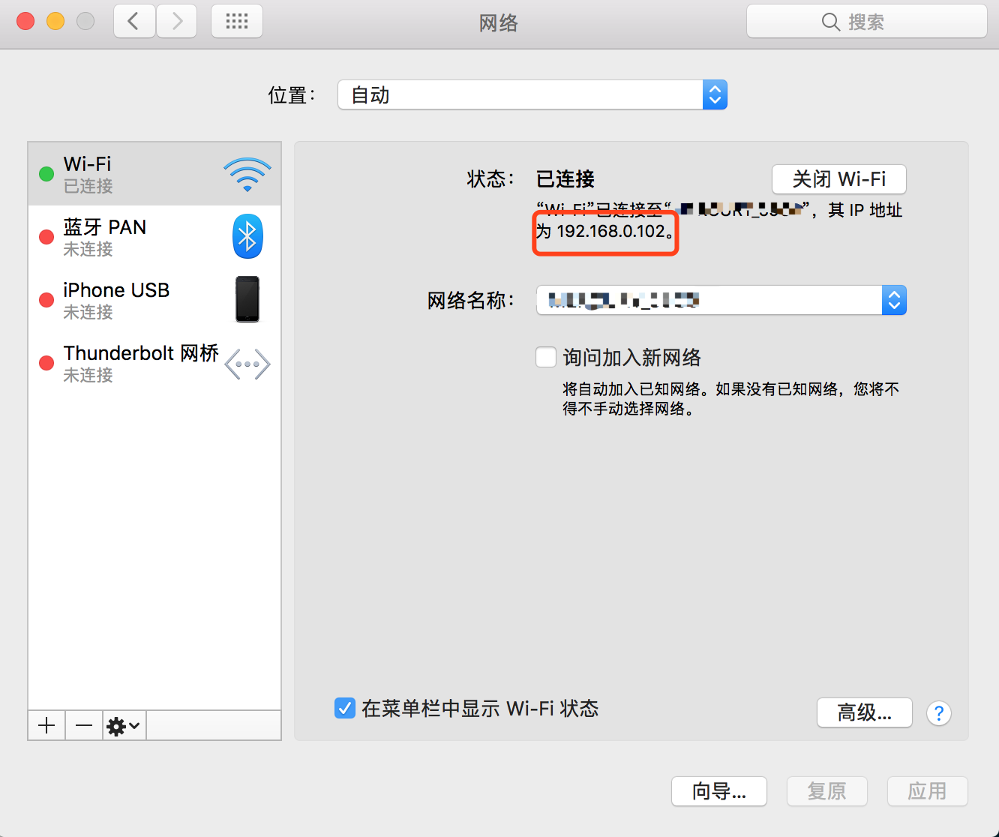

# webpack实战之局域网调试

## 前言
这可能是一系列实战教程，关于webpack配置及调优, vue, react 还不赶紧搬来小板凳围观


## 背景
当我们在使用webpack本地开发，会不会迫不及待想让处于局域网的同事看看自己作(八)品(哥)，或者是想用自己的手机看看效果，如果你有同样的想法，那么请往下读。

## demo
为了理解起来方便，我写了一个[demo](https://github.com/wangzianangis/webpack_demos/tree/master/webpack_LAN_debug)，同学们可以动手改改。
## 正文
webpack使用webpack-dev-server作为开发时的server，它其实是nodejs的框架express的一个中间件，因其使用方便，功能强大，被大多数开发者喜爱。要实现局域网调试，就得从它入手了。好了，首先让我们获取一下自己电脑的ip，如下图。笔者是Mac党，使用其它系统的同学请自觉搜索。




我的ip是192.168.0.102

接下来写一份webpack的配置文件，这个文件是webpack在启动时需要读取配置文件。

```
var path = require('path')
var webpack = require('webpack')

module.exports = {
  //入口文件
  entry: './src/main.js',
  //输出文件
  output: {
    path: path.resolve(__dirname, './dist'),
    publicPath: '/dist/',
    filename: 'build.js'
  },
  module: {
    rules: [
      {
        test: /\.vue$/,
        loader: 'vue-loader',
        options: {
          loaders: {
          }
        }
      },
      {
        test: /\.js$/,
        loader: 'babel-loader',
        exclude: /node_modules/
      }
    ]
  },
  resolve: {
    alias: {
      'vue$': 'vue/dist/vue.esm.js'
    }
  },
  devServer: {
    historyApiFallback: true,
    noInfo: true
  },
  performance: {
    hints: false
  },
  devtool: '#eval-source-map'
}
```
然后准备一份npm的配置文件package.json,在里面可以有node的启动脚本，就是所谓的npm scripts
```
{
  "name": "webpack_demo_1",
  "description": "A Vue.js project",
  "version": "1.0.0",
  "author": "Darcy_Wang <wangziangis@gmail.com>",
  "private": true,
  "scripts": {
    "dev": "cross-env NODE_ENV=development webpack-dev-server --open --hot",
    "build": "cross-env NODE_ENV=production webpack --progress --hide-modules"
  },
  "dependencies": {
    "vue": "^2.2.1"
  },
  "devDependencies": {
    "babel-core": "^6.0.0",
    "babel-loader": "^6.0.0",
    "babel-preset-latest": "^6.0.0",
    "cross-env": "^3.0.0",
    "css-loader": "^0.25.0",
    "file-loader": "^0.9.0",
    "vue-loader": "^11.1.4",
    "vue-template-compiler": "^2.2.1",
    "webpack": "^2.2.0",
    "webpack-dev-server": "^2.2.0"
  }
}
```
这时如果运行`npm run dev`,用手机访问这个url your_ip:your_port，会发现无法访问。

接下来我们对它进行改造。首先，在package.json的dev脚本中追加一点东西，让网站在特定的端口启动。
```
"dev": "cross-env NODE_ENV=development webpack-dev-server --open --hot --host 0.0.0.0 --port 8089",
```

然后，在webpack.config.js中添加一个入口文件。
```
  //入口文件
  entry: [
    'webpack-dev-server/client?http://0.0.0.0:8089',
    './src/main.js'   
    ],
```

此时，运行`npm run dev`,用手机访问这个url your_ip:your_port，看看有没有惊喜。

## 拓展阅读
[https://webpack.github.io/docs/webpack-dev-server.html](https://webpack.github.io/docs/webpack-dev-server.html)


